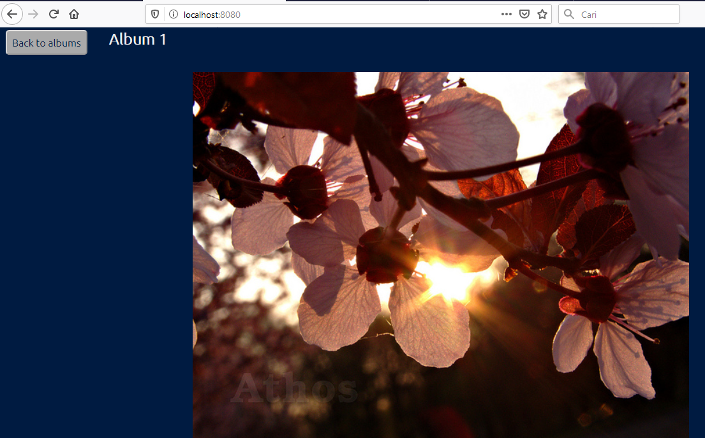

# TUGAS UTS
## Lukman Surya Laksana 
## 175410037   

1. Membuat Folder baru  
-- mkdir galery
2. Masuk ke ke root folder yg di buat tadi  
-- cd galeryhome
<pre>
PS C:\Users\User> cd galeryhome
PS C:\Users\User\galeryhome> ls

    Directory: C:\Users\User\galeryhome

Mode                LastWriteTime         Length Name
----                -------------         ------ ----
d-----       10/28/2019   7:17 PM                galery
-a----       10/28/2019   7:22 PM             54 Dockerfile
</pre>  
3. Cari aplikasi kemudian download aplikasi tersebut dengan cara menggunakan git clone  
--   git clone https://github.com/gyorkop/HTML5-gallery.git  .    
<pre>
PS C:\Users\User> git clone https://github.com/gyorkop/HTML5-gallery.git galery
Cloning into 'galery'...
remote: Enumerating objects: 61, done.
remote: Total 61 (delta 0), reused 0 (delta 0), pack-reused 61
Unpacking objects: 100% (61/61), done.
</pre>  
4. Membuat Dockerfile di dalam folder tadi, Pada Dockerfile tadi isikan script berikut   
-- FROM nginx:alpine  
-- COPY ./galery /usr/share/nginx/html
<pre>
FROM nginx:alpine
COPY ./galery /usr/share/nginx/html
</pre>  
5. Membuat image dari Dockerfile  
-- docker build -t lukmansl1994/galery-luk:v1 .  
<pre>
PS C:\Users\User\galeryhome> docker build -t lukmansl1994/galery-luk:v1 .
Sending build context to Docker daemon  6.139MB
Step 1/2 : FROM nginx:alpine
alpine: Pulling from library/nginx
89d9c30c1d48: Pull complete                                                                                             110ad692b782: Pull complete                                                                                             Digest: sha256:085e84650dbe56f27ca3ed00063a12d5b486e40c3d16d83c4e6c2aad1e4045ab
Status: Downloaded newer image for nginx:alpine
 ---> b6753551581f
Step 2/2 : COPY ./galery /usr/share/nginx/html
 ---> e04900a87f1e
Successfully built e04900a87f1e
Successfully tagged lukmansl1994/galery-luk:v1
SECURITY WARNING: You are building a Docker image from Windows against a non-Windows Docker host. All files and directories added to build context will have '-rwxr-xr-x' permissions. It is recommended to double check and reset permissions for sensitive files and directories.
</pre>  
6. Untuk Melihat image yang dibuat tadi menggunakan perintah  
-- Docker images  
<pre>
PS C:\Users\User\galeryhome> docker images
REPOSITORY                TAG                 IMAGE ID            CREATED             SIZE
lukmansl1994/galery-luk   v1                  e04900a87f1e        27 seconds ago      27.4MB
nginx                     alpine              b6753551581f        5 days ago          21.4MB
cockroachdb/cockroach     latest              82ebb27f44e8        4 weeks ago         190MB
ubuntu                    latest              2ca708c1c9cc        5 weeks ago         64.2MB
</pre>  
5. Menjalankan image menjadi container  
-- docker run -d -p 8080:80  --name=galery lukmansl1994/galery-luk:v1
<pre>
PS C:\Users\User\galeryhome> docker run -d -p 8080:80  --name=galery lukmansl1994/galery-luk:v1
ac40c8d468f356f908fc71849ecb69660264a7bf9b65a5c6a66d5afafba89bd7
</pre>
6. Melihat contaner yang sedang berjalan  
-- Docker ps
<pre>
PS C:\Users\User\galeryhome> docker ps
CONTAINER ID        IMAGE                        COMMAND                  CREATED             STATUS              PORTS                  NAMES
ac40c8d468f3        lukmansl1994/galery-luk:v1   "nginx -g 'daemon of…"   50 seconds ago      Up 46 seconds       0.0.0.0:8080->80/tcp   galery
</pre>
7. Cek di browser
-- localhos:8080  
  
   
 
8. Mengupload ke hub.docker.com  (daftar Dockerhub terlebih dahulu)  
9. login ke docker hub
-- docker login docker.io  
<pre>
PS C:\Users\User> docker login docker.io
Login with your Docker ID to push and pull images from Docker Hub. If you don't have a Docker ID, head over to https://hub.docker.com to create one.
Username: lukmansl1994
Password:
Login Succeeded
</pre>    
10. Kemudian upload image yang di buat tadi
-- docker push lukmansl1994/galery:v1  
</pre>
The push refers to repository [docker.io/lukmansl1994/galery]
70c0b10d9fec: Pushed                                                                                                    bba7d2385bc1: Mounted from library/nginx                                                                                77cae8ab23bf: Mounted from library/nginx                                                                                v1: digest: sha256:52205eb455a47c03e72b66807e5e43f281a3a6bb4eba00099c5aa3c469d7fc91 size: 950
PS C:\Users\User>
</pre>  

11. Silahkan dilihat website hub.docker.com pada link dibawah berikut inihttps://cloud.docker.com/repository/docker/lukmansl1994/galery  
  

