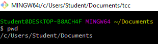
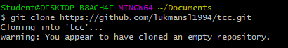
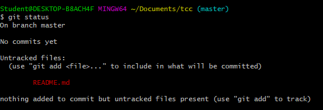
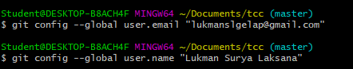
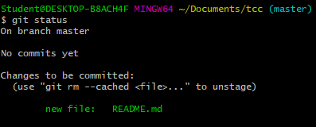
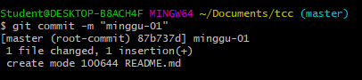
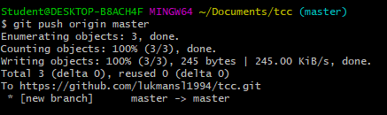
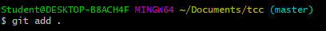

# MINGGU 01
1. Cek Folder menggunakan pwd  

2. Clone / memasukan repo 
 
3. Masuk Folder tcc 
 
4. Cek status apakah ada perubahan atau tidak  (Merah berarti belum ada perubahan )
   
5. Menambah Jika Ada Perubahan  
 
6. Menambahkan alamat email dan nama kita  
  
7. cek status setelah ada perubahan (akan berwarna hijau)
   
8. perintah commit untuk menutup perintah
    
9. perintah push untuk memasukan file ke dalam repo 
  
10. Menambah sebuah file tambah harus menjalankan perintah awal / menambahkan file yang berubah ke git 
 
