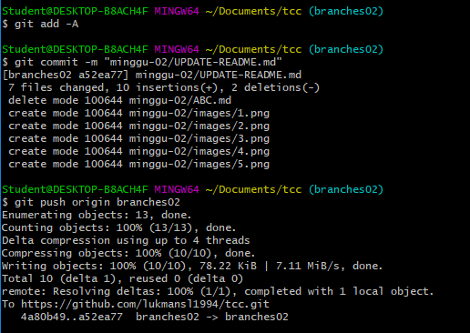
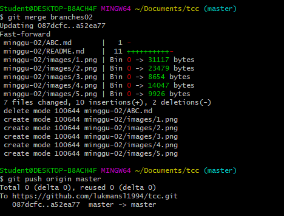

# MINGGU 02  

1. Membuat Repo Baru  
  
2. Membuat filebaru dengan nama ABC.md  

3. Menampilkan file ABC.md dan kemudian di hapus  
  
4. Membuat branches baru  
  
5. Merubah lokasi dari branches02 ke branches master  

6. Menambahkan dan commit perubahan-perubahan tersebut ke branch kemudian di lanjutkan dengan perintah push atau memasukan data yang sudah ter update  
    
7. Menggabungkan master cabang dari cabang baru, dan trus di lanjutkan push kembali supaya masuk ke GITHUB  
  
