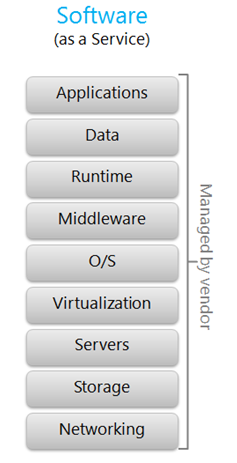

# MINGGU 03  
# TUGAS PRATIKUM TEGNOLOGI CLOUD DEFINISI SAAS

**Definisi SaaS**  
Software as a Service adalah layanan komputasi awan dimana kita bisa langsung menggunakan aplikasi yang telah isediakan. Penyedia layanan mengelola infrastruktur dan platform yang menjalankan aplikasi tersebut. Contoh layanan aplikasi email yaitu gmail, yahoo dan outlook sedangkan contoh aplikasi media sosial adalah twitter, facebook dan google+. Keuntungan dari layanan ini adalah pengguna tidak perlu membeli lisensi untuk mengakses aplikasi tersebut. Pengguna hanya membutuhkan perangkat klien komputasi awan yang terhubung ke internet. Ada juga aplikasi yang mengharuskan pengguna untuk berlangganan agar bisa mengakses aplikasi yaitu Office 365 dan Adobe Creative Cloud. (tinggal pake, free, all app udh ada, mudah, tak prlu update, versi ytg sama, mudah kolaborasi aksesibilitas global.  

Pertama, Software as a Service (SaaS). SaaS adalah model dimana aplikasi “ditawarkan” kepada klien sebagai sebuah layanan. Jika sebuah aplikasi/software disajikan kepada klien klien tidak perlu merawat dan melakukan update pada aplikasi tersebut. Tapi sebaliknya, jika provider hendak mengganti atau melakukan update pada aplikasi tersebut, kita hanya bisa mengikuti mereka saja tanpa bisa melakukan apa-apa.
Inti pemikirannya adalah kita menggunakan software yang ada pada layanan provider dan provider harus menjaga kenyamanan kita menggunakan software tersebut, termasuk memikirkan tentang update, keamanan dan infrastrukturnya. Software as a Service

**Keuntungan:**  
1. Akses Secara Real Time  
2. Mengemat Pengeluaran  
3. Meningkatkan Efisiensi Kerja  
4. Dinamis dan Fleksibel  
5. Meningkatkan Skalabilitas  

**Kerugian:**  
* Pengguna tidak memiliki kendali penuh atas aplikasi yang disewa. Pengguna tidak dapat dengan seenaknya mengubah fitur-fitur yang disediakan karena SaaS bersifat multi-tenant sehingga fitur-fitur yang dibuat adalah fitur yang umum (tidak bisa spesifik terhadap kebutuhan pengguna tertentu). Pada beberapa aplikasi, kustomisasi dapat dilakukan dengan skala dan fungsi yang terbatas.

**Contoh SaaS** 
* Google Doc
* Google Spreadsheet 
* Google Presentation
* Drobox

# **Arsitektur SaaS**  
  