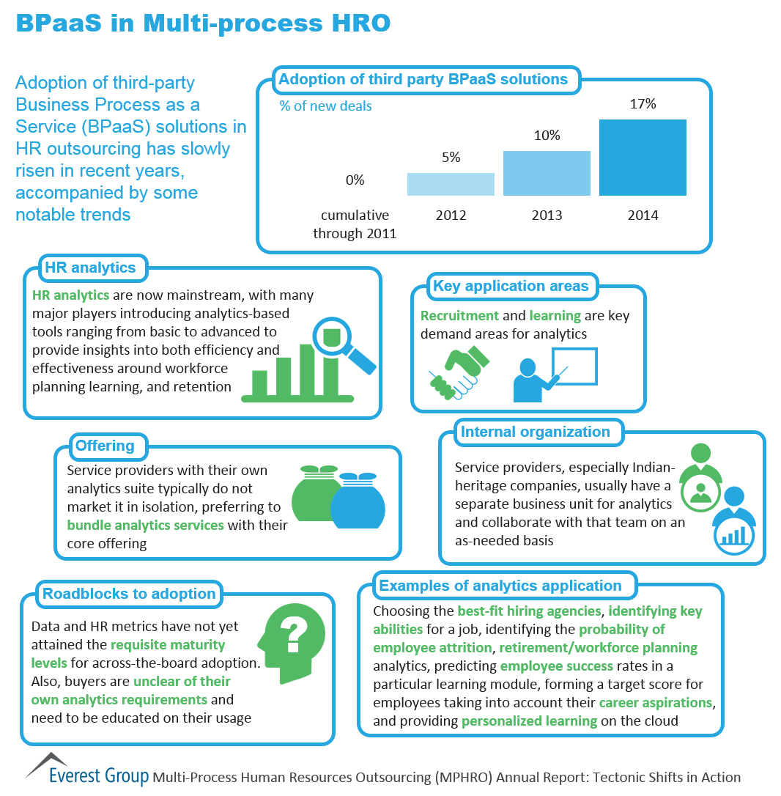

# MINGGU 04  
# TUGAS PRATIKUM TEKNOLOGI CLOUD BPAAS

**Definisi BPAAS**  
Proses Bisnis Sebagai Layanan (BPaaS) adalah jenis proses bisnis horizontal atau vertikal yang disampaikan berdasarkan model layanan awan. Layanan awan ini - yang mencakup Perangkat Lunak sebagai Layanan (SaaS), Platform sebagai Layanan (PaaS), dan Infrastruktur sebagai Layanan (IaaS) - oleh karena itu bergantung pada layanan terkait.

Perusahaan telah mengotomatisasi proses bisnis selama beberapa dekade. Awalnya, mereka terpaksa melakukannya secara manual atau pemrograman. Misalnya, jika perusahaan ingin memastikan bahwa sistem manajemen untuk pesanan mendongak cek kredit sebelum mengeluarkan transaksi, perusahaan membuat permintaan itu ke dalam sebuah program.

Dalam beberapa kasus, seluruh proses bisnis perusahaan outsourcing dapat menerapkan proses secara manual atau melalui otomasi. Dengan dimulainya komputasi awan, pendekatan ini mulai berubah. Semakin banyak perusahaan melihat pendekatan layanan yang berorientasi pada layanan. Alih-alih menganggap Anda memerlukan aplikasi paket yang mencakup logika bisnis, data, dan proses, mungkin saja Anda memilih aplikasi proses yang tidak terkait dengan satu aplikasi.

**KARAKTERISTIK**  
* PaaS duduk di atas tiga layanan awan pendiri lainnya: SaaS, PaaS, dan IaaS.  
* Layanan BPaaS dapat dikonfigurasi berdasarkan proses yang sedang dirancang.  
* Layanan BPaaS harus memiliki API yang terdefinisi dengan baik sehingga mudah dihubungkan ke layanan terkait.  
* BPaaS harus dapat mendukung banyak bahasa dan beberapa lingkungan penerapan karena bisnis tidak dapat memprediksi bagaimana proses   bisnis akan dimanfaatkan di masa depan.  
* Lingkungan BPaaS harus bisa menangani skala besar. Layanan harus bisa pergi dari pengelolaan beberapa proses untuk beberapa pelanggan untuk dapat mendukung ratusan bahkan ribuan pelanggan dan proses. Layanan ini mencapai tujuan tersebut dengan mengoptimalkan layanan awan yang mendasari untuk mendukung jenis elastisitas dan penskalaan ini.  

**CONTOH**  
*Diskripsi*  
gtHR adalah software yang memberikan kemudahan dalam pengelolaan data karyawan, pencatatan proses mutasi, penilaian kerja, penyederhanaan pengelolaan gaji dan penghitungan PPh (Pajak Penghasilan) serta melakukan rekapitulasi kehadiran karyawan. gtEnterprise HR dibangun dengan tujuan agar pengelola perusahaan mengetahui kondisi karyawan dan pada akhirnya dapat mengambil keputusan yang tepat terkait dengan strategi SDM yang akan di terapkan pada perusahaan tersebut.
Software gtHR dirancang agar dapat mengelola database presensi karyawan, baik yang dilakukan dengan sistem barcode, fingerprint dan smartcard, dan kemudian mengintegrasikannya dengan sistem payroll karyawan. Kerumitan dalam penghitungan gaji dan mengetahui kapan karyawan habis kontrak, dapat diselesaikan dengan aplikasi ini.

*Keuntungan Bisnis*  
* Siap untuk diintegrasikan dengan smartcard & door access attendance system
* Layanan mandiri untuk karyawan dan manajemen (cetak slip gaji, pengajuan cuit, update CV, dst).
* Data Induk Pegawai yang lengkap.
* Dapat menyimpan data hingga yang bersifat multiple data, seperti data identitas, riwayat pendidikan, nomor telepon, email, rekening bank, hingga asuransi yang diikuti pegawai.  

*Features*   
*Data Pegawai*  
* Data Personal
* Suami/Istri
* Anak
* Orangtua / Mertua
* Saudara
* Mutasi Pegawai
* Pangkat / Golongan
* Jabatan / Posisi Kerja

*Payroll Pegawai*  
* Komponen Gaji
* Jamsostek
* THR
* PPH 21
* Perhitungan Gaji Karyawan  

*Penilaian Kerja*  
* Laporan
* Pegawai
* Cuti
* Ijin
* Lembur
* Kehadiran.

 

**Sumber**
* https://id.howtodou.com/what-is-business-process-as-service-in-cloud-computing
* https://www.gamatechno.com/products-services-detail/43-corporate-suite/254-gthr-2  