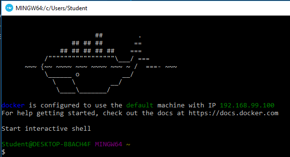
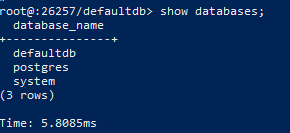
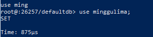
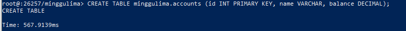
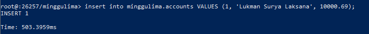

# MINGGU 05  
# TUGAS PRATIKUM INSTALL DAN JALANKAN COCKROACH DATABSE

1. Install cockroach database  
* Jalankan Docker Quickstart Terminal  
  
* Jalankan perintah docker pull cockroachdb/cockroach  
  
2. Konfigurasi 
* Buat Bridge Network pada docker
-- docker network create -d bridge roachnet

* Jalankan service cockroachdb 
-- docker run -d --name=roach1 --hostname=roach1 --net=roachnet -p 26257:26257 -p 8080:8080 cockroachdb/cockroach start --insecure   
   
* Cek container, pastikan UP  
-- docker ps -a  
  
* Test Cluster  
-- docker exec -it roach1 ./cockroach sql --insecure  
   
3. Create Databse dengan nama minggulima
-- create database minggulima; 
   
* cek database  
-- show databases; 
   
* menghubugkan databse/mengkonekkan    
-- use minggulima;  
  
4. create Tabel  
-- CREATE TABLE minggulima.accounts (id INT PRIMARY KEY, name VARCHAR, balance DECIMAL);
(yang dimana uuntuk nama tabel accounts di database minggulima)  
  
  
5. Insert atau memasukan data kedalam tabel  
-- insert into minggulima.accounts VALUES (1, 'Lukman Surya Laksana', 10000.69);  

