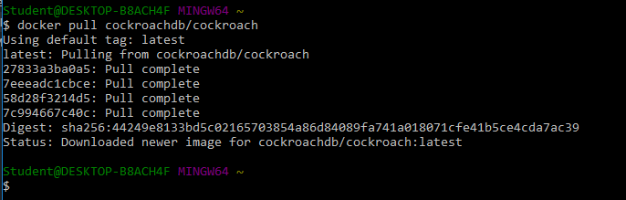
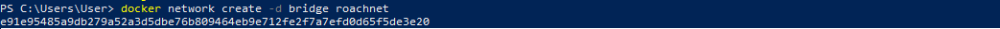
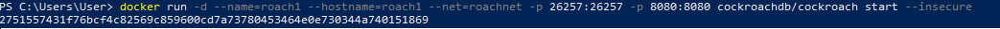
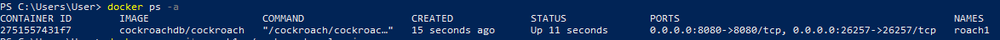
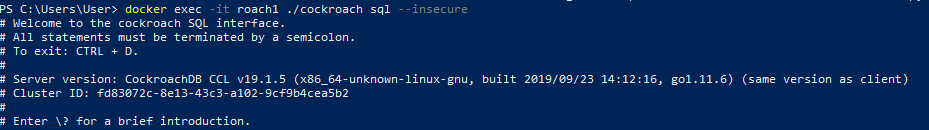
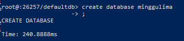

# MINGGU 05  
# TUGAS PRATIKUM INSTALL DAN JALANKAN COCKROACH DATABSE

1. Install cockroach database  
* Jalankan Docker Quickstart Terminal  
  
-- Jalankan perintah docker pull cockroachdb/cockroach  
  
2. Konfigurasi    

3. Create Databse   
  
4. create Tabel   
  
5. Merubah lokasi dari branches02 ke branches master  

6. Vi Data   
    
7. Query Data  
 