# MINGGU 06   
# TUGAS PRATIKUM BIKIN LAPORAN BERDASARKAN LINK BERIKUT :

1. https://www.katacoda.com/courses/docker/deploying-first-container  
2. https://www.katacoda.com/courses/docker/create-nginx-static-web-server  
3. https://www.katacoda.com/courses/docker/2  

# Menjalankan Url No.1   
* Gambar 1  
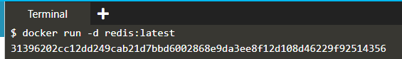 
-- Pada gambar Menjalankan image redis menjadi container    
* Gambar 2  
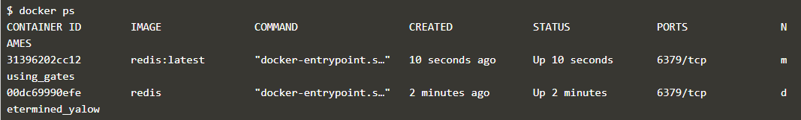 
-- Pada gambar 2 ini untuk melihat container yang sedang berjalan  
* Gambar 3  
-- docker network create -d bridge roachnet
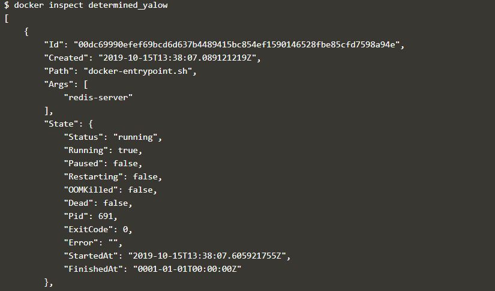
*  Gambar 4    
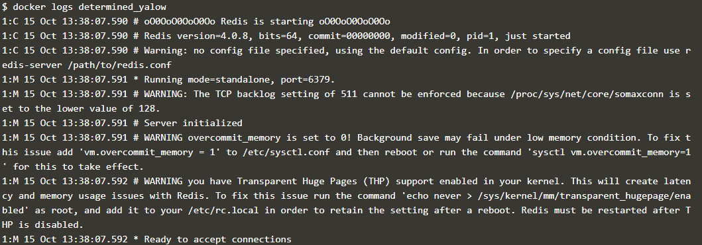   
* Gambar 5  
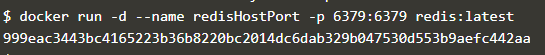  
* Gambar 6   
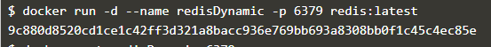   
* Gambar 7  
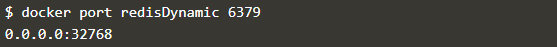   
* Gambar 8  
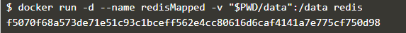   
* Gambar 9  
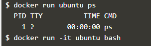  

# Menjalankan Url No.2  

1. Create Dockerfile  
* Membuat Dockerfile  
<pre>
FROM nginx:alpine
COPY . /usr/share/nginx/html
</pre>
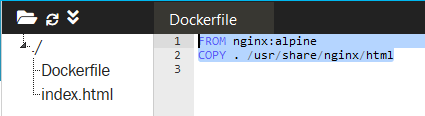  
2. Build Docker Image  
Membuat image dari Dockerfile yang di buat sebelumnya  
<pre>
docker build -t webserver-image:v1 .
</pre> 
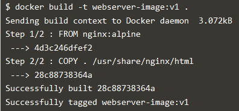  
3. Melihat/menampilkan isi dari images  
<pre>
docker images.
</pre>  
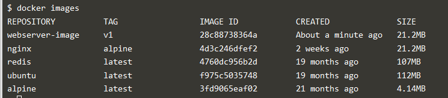 
4. Run  
* Menjalankan images menjadi sebuah container  
<pre>
docker run -d -p 80:80 webserver-image:v1  
</pre>  
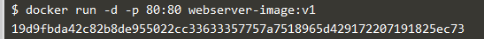  
5. Membuka halaman docker dengan curl  
<pre>
curl docker
</pre> 
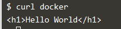 

