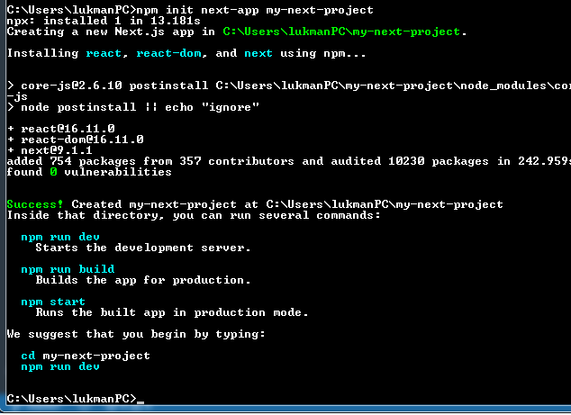
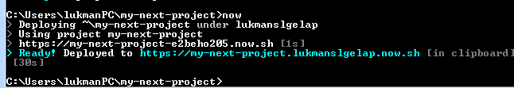

# MINGGU 07    

1. Daftar ZEIT.co , tapi jangan lupa install node.js terlebih dahulu https://nodejs.org/en/download/  

* Buka CMD/Power Shall ketikan perintah berikut  
-- npm i -g now  
<pre>
C:\Users\lukmanPC>npm i -g now

> now@16.4.0 preinstall C:\Users\lukmanPC\AppData\Roaming\npm\node_modules\now
> node ./scripts/preinstall.js

C:\Users\lukmanPC\AppData\Roaming\npm\now -> C:\Users\lukmanPC\AppData\Roaming\n
pm\node_modules\now\dist\index.js
+ now@16.4.0
added 1 package in 21.136s
</pre>

2. Buka CMD/Power Shall baru ketikan nama email yang terdaftar  
-- now login "namaanda@gmail.com"  
<pre>
C:\Users\lukmanPC>now login "lukmanslgelap@gmail.com"
> We sent an email to lukmanslgelap@gmail.com. Please follow the steps provided
  inside it and make sure the security code matches Sunny Guinea Fowl.
V Email confirmed
> Congratulations! You are now logged in. In order to deploy something, run `now
`.
</pre> 
* jangan lupa setelah menjalankan perintah tersebut maka segera buka email anda, kemudian melakuakan verifikasi email.  

3. membuat project baru next.js dengan menggunakan perintah npm  
-- npm init next-app my-next-projec  

 

4. Deploy next-project dengan now
* masuk kedalam root projec yang dibuat  
-- cd my-next-projec  
   

* kemudian baru menggunakan perintah now  
-- now  
 
 
* Untuk melihat hasil project yang di buat tadi bisa kunjungi Url di bawah ini   
<pre>
https://my-next-project.lukmanslgelap.now.sh/
</pre>

