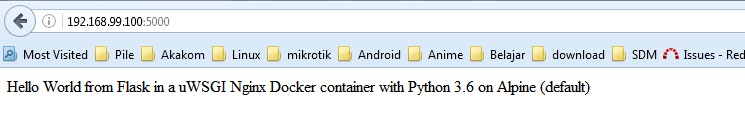

# MINGGU 09
# MELANJUTKAN MINGGU 08   
# PYTHON FT. FLASK 

1. Login GitHub.  
2. Masuk ke repo yang ingin kita fork `https://github.comshafirakp/tcc-1.git.`  
3. Klik tombol fork.  
4. Setelah klik fork, maka button fork akan ke disable.  
  
5. Clone repo yang sudah kita fork menggunakan perintah `git clone https://github.com/lukmansl1994/tcc-1.git`  
  
6. lihat track repository dengan perintah `git remote -v`  <pre>
</pre>  
7. Membuat konfigurasi repo upstream.  
<pre>
</pre>  
8. 

