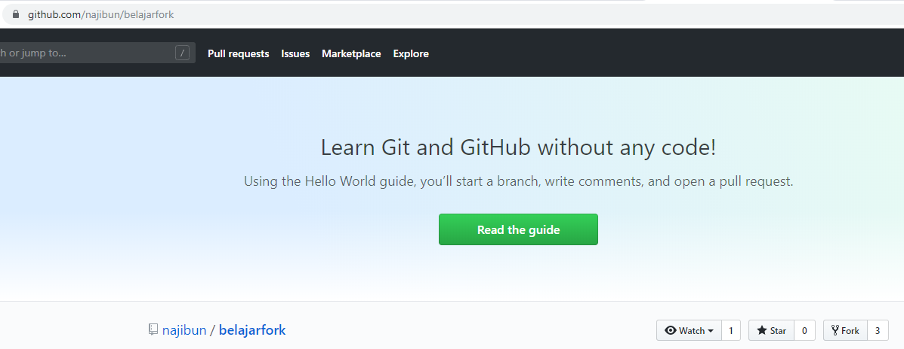
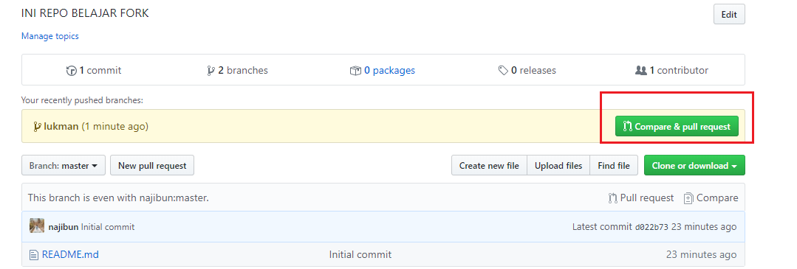
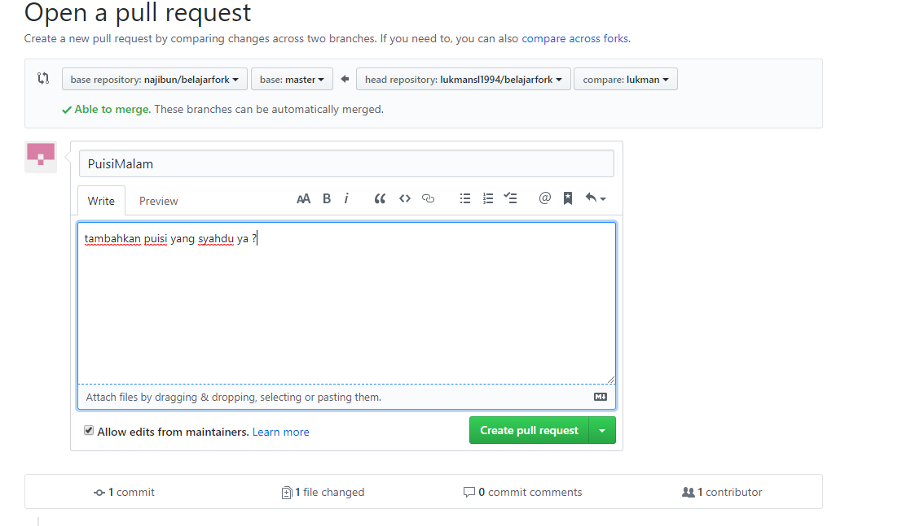
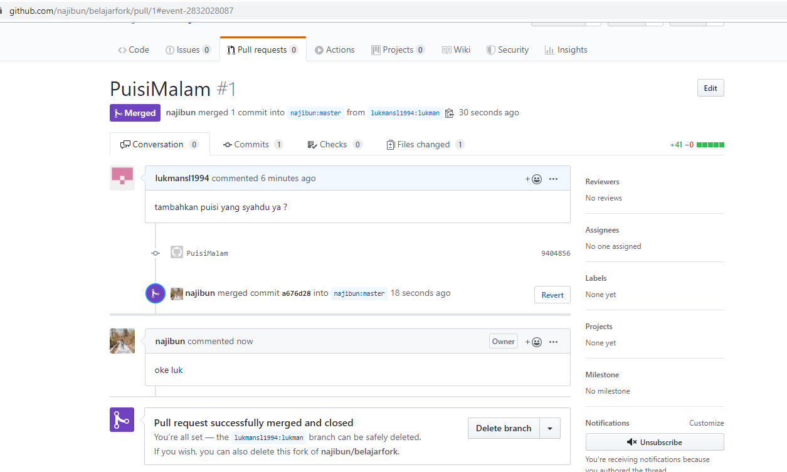

# MINGGU 10
# KOLABORASI  
## Kolaborasi disini menggunakan Akses repo yang akan di-fork https://github.com/lukmansl1994/belajarfork.git

1. Clone belajarork terlebih dahulu kemudian masuk di  repo tersebut  
<pre>
Student@DESKTOP-B8ACH4F MINGW64 ~/Documents
$ git clone https://github.com/lukmansl1994/belajarfork.git
Cloning into 'belajarfork'...
remote: Enumerating objects: 3, done.
remote: Counting objects: 100% (3/3), done.
remote: Total 3 (delta 0), reused 0 (delta 0), pack-reused 0
Unpacking objects: 100% (3/3), done.
Checking connectivity... done.

Student@DESKTOP-B8ACH4F MINGW64 ~/Documents
$ cd belajarfork
</pre>  

1. Login ke GitHub dan masuk ke repo fork tersebut, Pilih fork  
  
2. Lihat repository yang ada  
<pre>
$ git remote -v  
origin  https://github.com/lukmansl1994/belajarfork.git (fetch)
origin  https://github.com/lukmansl1994/belajarfork.git (push)
upstream        https://github.com/najibun/belajarfork.git (fetch)
upstream        https://github.com/najibun/belajarfork.git (push)
</pre>  
3. Update dari upstream ke master  
<pre>
$ git fetch upstream  
From https://github.com/najibun/belajarfork
 * [new branch]      master     -> upstream/master
</pre>  
4. Buat brach baru dengan nama lukman
<pre>
$ git checkout -b lukman 
Switched to a new branch 'lukman' 
</pre>  
5. Melihat branch dan yang di commit
<pre>
$ git branch -v 
* lukman d022b73 Initial commit
  master d022b73 Initial commit
</pre>
6. Edit readme  dan menambahkan jika ada perubahan  
<pre>
$ vim README.md

$ git add . 
</pre>  
7. Perintah commit untuk menutup perintah 
<pre>
$ git commit -m "PuisiMalam"
[lukman 9404856] PuisiMalam
 1 file changed, 41 insertions(+)
 create mode 100644 PuisiMalam.txt
 </pre>  
8. Berpindah ke branch master
<pre>
$ git checkout master 
Switched to branch 'master'
Your branch is up-to-date with 'origin/master'.
</pre>  
9. Melihat isi belajarfork  
<pre>
$ ls -al
total 13
drwxr-xr-x 1 Student 197121  0 Nov 26 20:50 ./
drwxr-xr-x 1 Student 197121  0 Nov 26 20:37 ../
drwxr-xr-x 1 Student 197121  0 Nov 26 20:50 .git/
-rw-r--r-- 1 Student 197121 38 Nov 26 20:37 README.md
</pre>  
10. Perpindah ke branch lukman 
<pre>
$ git checkout lukman 
Switched to branch 'lukman'
</pre>  
11. Perintah push untuk memasukan file ke dalam repo branch lukman  
<pre>
$ git push origin lukman 
Fatal: AggregateException encountered.
Username for 'https://github.com': lukmansl1994
Counting objects: 3, done.
Delta compression using up to 4 threads.
Compressing objects: 100% (3/3), done.
Writing objects: 100% (3/3), 638 bytes | 0 bytes/s, done.
Total 3 (delta 0), reused 0 (delta 0)
remote:
remote: Create a pull request for 'lukman' on GitHub by visiting:
remote:      https://github.com/lukmansl1994/belajarfork/pull/new/lukman
remote:
To https://github.com/lukmansl1994/belajarfork.git
 * [new branch]      lukman -> lukman
</pre>  
12. Setelah itu, buka halaman Web dari repo kontributor https://github.com/lukmansl1994/belajarfork.git Pada halaman tersebut akan ditampilkan isi yang kita push.
  
   
* Balasan dari repo belajarfork  
   
13. Berpindah ke branch Master  
<pre>
$ git checkout master
Switched to branch 'master'
Your branch is up-to-date with 'origin/master'.
</pre>  
14. Lihat branch yang di pakai, kalau ada tanda * maka itu yg di pakai
<pre>
$ git branch
  lukman
* master
</pre>  
15. Ambil dari repo upstream
<pre>
$ git fetch upstream 
remote: Enumerating objects: 11, done.
remote: Counting objects: 100% (10/10), done.
remote: Compressing objects: 100% (6/6), done.
remote: Total 7 (delta 0), reused 4 (delta 0), pack-reused 0
Unpacking objects: 100% (7/7), done.
From https://github.com/najibun/belajarfork
   d022b73..9fbe04a  master     -> upstream/master
</pre>  
16. Menggabungkan upstream dan master  
<pre>
$ git merge upstream/master
Updating d022b73..9fbe04a
Fast-forward
 PuisiMalam.txt | 41 +++++++++++++++++++++++++++++++++++++++++
 README.md      |  1 +
 pantun.txt     |  7 +++++++
 3 files changed, 49 insertions(+)
 create mode 100644 PuisiMalam.txt
 create mode 100644 pantun.txt
</pre>  

